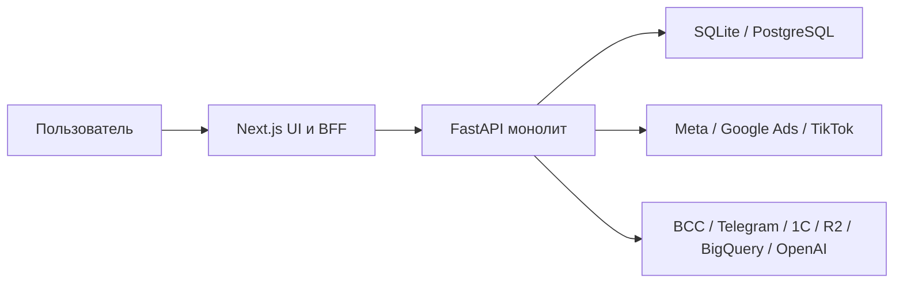

# Текущее состояние Envidicy

Статус: `Review Candidate Evidence v0.1`

Baseline: `ENVIDICY-ARCH-RC-2026-07-23-01`

## 1. Краткий вывод

Текущий репозиторий — работающий ранний production-продукт в области управления рекламными кабинетами и рекламными финансами. Его корректно рассматривать как:

> **Advertising OS v0.x с встроенными и пока не отделёнными возможностями будущего Envidicy Core.**

Это не универсальный Core и не вся Marketing OS. При этом платформа уже содержит достаточно реальных операций, чтобы стать основой дальнейшей экосистемы без полной переписки.

## 2. Фактическая архитектура

Основные характеристики:

- основной интерфейс: Next.js 15 и React 19;
- legacy-интерфейс: статические HTML/JS-страницы;
- backend: FastAPI-монолит с 162 HTTP endpoint'ами;
- хранение: SQLite локально и PostgreSQL в production;
- бизнес-логика, auth, интеграции, финансы и отчётность сосредоточены преимущественно в одном backend-модуле;
- Next.js одновременно является интерфейсом, proxy/BFF и слоем подготовки части финансовых view model;
- системных миграций, устойчивой очереди и полноценного CI пока нет.

## 3. Что уже относится к Advertising OS

### 3.1. Advertising Account Management

- заявки на открытие кабинетов;
- lifecycle `new → processing → approved/rejected`;
- рекламные кабинеты Meta, Google, TikTok, Yandex, Telegram и Monochrome;
- статусы, внешние ID, валюты, клиентская видимость;
- прямое и агентское владение;
- персональные группы и фильтры кабинетов;
- делегированный доступ и impersonation.

### 3.2. Top-up and Finance

- общий клиентский кошелёк;
- заявки на пополнение кошелька;
- счета, юрлица, договоры и issuer-профили;
- комиссии, VAT, FX по курсам BCC;
- holds и wallet transactions;
- заявки на пополнение рекламного кабинета;
- funding events и reversals;
- агентские кошельки, rebates и переводы;
- ручная операционная обработка большинства платформ;
- автоматическое увеличение Meta `spend_cap` с проверкой результата; durable межпроцессная идемпотентность и reconciliation ещё требуются.

### 3.3. Analytics and Reporting

- Meta, Google Ads и TikTok insights;
- кампании и дневная статистика;
- Meta/Google audience breakdowns;
- live billing и balance;
- performance dashboard;
- finance snapshots;
- PDF, Excel и CSV;
- read-only Integration API v1.

### 3.4. Дополнительные возможности

- медиапланирование и plan/fact;
- AI-помощник медиаплана;
- UTM-генератор;
- документы клиента;
- публичная документация API;
- уведомления и Telegram-оператор.

## 4. Что является proto-Core

Следующие возможности уже существуют, но пока реализованы внутри рекламной вертикали:

| Текущая возможность | Целевой домен |
|---|---|
| Пользователи, пароли и токены | Core Identity |
| Дополнительные email-доступы | Core Memberships |
| Агентства и их участники | Core Organizations / Workspaces |
| Клиентские и агентские кошельки | Core Billing |
| Wallet transactions | Core Ledger |
| Счета и юрлица | Core Billing / Documents |
| API-ключи | Core Identity / Developer Access |
| Meta OAuth и provider credentials | Core Integration Vault + product connector |
| Документы и аватары | Core File Storage |
| Уведомления | Core Notification Center |
| Часть журналов операций | Core Audit |
| Background job leases | Shared Job Runtime |

## 5. Чего пока нет как универсальной платформы

- полноценной модели `Organization → Workspace → Project`;
- единой модели Project как контекста предметных данных там, где он применим;
- универсальной политики ролей и действий;
- Module Registry, entitlements и продуктовых подписок;
- общего double-entry ledger;
- безопасного Integration Vault;
- канонического event envelope и transactional outbox;
- общей очереди фоновых заданий и retry;
- общей модели файлов, версий и политик хранения;
- единого аудита пользовательских, сервисных и AI-действий;
- общей Data Platform и устойчивого ingestion pipeline;
- формализованного API между Core и продуктами.

## 6. Зрелость рекламных интеграций

| Платформа | Аналитика | Billing / balance | Пополнение |
|---|---|---|---|
| Meta | высокая | live spend, cap, balance | автоматическое изменение `spend_cap` |
| Google Ads | средняя | spend/limit при доступности | ручной workflow |
| TikTok | средняя | report и попытка balance API | ручной workflow |
| Yandex Direct | отсутствует | внутренний учёт | ручной workflow |
| Telegram Ads | отсутствует | внутренний учёт | ручной workflow |
| Monochrome | отсутствует | внутренний учёт | ручной workflow |

## 7. Архитектурные ограничения текущего состояния

При дальнейшем проектировании считаются обязательными к устранению:

1. денежные значения в floating-point;
2. read-modify-write баланса без достаточной конкурентной защиты;
3. смешение рекламной операции и движения денег;
4. неаутентифицированные входящие операции счетов;
5. runtime-схема вместо версионированных миграций;
6. синхронные внешние side effect без outbox/retry/reconciliation;
7. хранение чувствительных токенов без полноценного vault;
8. client-side session token и слабая модель admin RBAC;
9. ручной ingestion рекламной статистики;
10. дублирование расчётов между backend и BFF;
11. несколько параллельных UI-архитектур;
12. отсутствие сквозных тестов денежного цикла и deploy gate.

## 8. Правило перехода

Текущая система не выбрасывается и не переписывается целиком.

Каждая будущая работа относится к одному из типов:

- **Stabilize** — исправление рисков без изменения границ;
- **Modularize** — выделение логического домена внутри монолита;
- **Contract** — введение API, события или ownership;
- **Migrate** — перенос данных и поведения на новую модель;
- **Extract** — физическое выделение сервиса при доказанной необходимости;
- **Retire** — удаление legacy после подтверждённого перехода.

Физическое выделение микросервисов не является целью само по себе.
