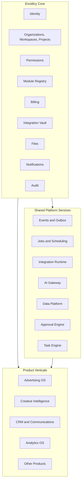

# Границы Envidicy Core, общих сервисов и продуктов

Статус: `Review Candidate v0.1`

Baseline: `ENVIDICY-ARCH-RC-2026-07-23-01`

## 1. Назначение разделения

Цель разделения — не разнести систему по разным репозиториям, а определить:

- кто владеет данными;
- где находятся бизнес-правила;
- через какие контракты взаимодействуют модули;
- что можно переиспользовать;
- что можно развивать независимо;
- какие изменения не должны затрагивать другие продукты.

## 2. Три логических слоя



### 2.1. Envidicy Core

Core хранит универсальные бизнес-сущности и правила, необходимые каждому продукту:

- кто действует;
- от имени какой организации;
- в каком workspace и проекте;
- какие продукты и функции доступны;
- какие права имеет actor;
- как учитываются деньги;
- где зарегистрированы интеграции и файлы;
- как уведомить пользователя;
- как доказать, что действие произошло.

### 2.2. Shared Platform Services

Общие сервисы предоставляют технологические возможности нескольким продуктам, но не являются источником истины для продуктовых сущностей:

- доставка событий;
- очереди, retry и scheduler;
- выполнение коннекторов;
- маршрутизация AI-моделей;
- аналитическое хранение;
- согласования и задачи.

### 2.3. Product Verticals

Продукты владеют специфическими объектами и бизнес-правилами. Например:

- Advertising OS знает, что такое рекламный кабинет, кампания и `spend_cap`;
- Creative Intelligence знает, что такое creative snapshot, hook и pattern;
- CRM знает, что такое lead, deal и pipeline stage.

Core не должен содержать эти понятия.

## 3. Тест принадлежности функции

Функция относится к Core, если:

1. она задаёт общую гарантию владения, безопасности, доступа или денег;
2. её можно описать без словаря конкретной продуктовой вертикали;
3. единый источник истины предотвращает финансовые, правовые или security-расхождения;
4. у неё есть стабильный lifecycle и контракт;
5. подтверждены минимум два потребителя **либо** критическая платформенная необходимость уже доказана первым продуктом.

Повторное использование само по себе не делает функцию Core. Если одинаковой является техническая механика, но не бизнес-сущность, это shared service. Уникальный коммерческий сценарий остаётся в продукте.

## 4. Матрица ответственности

| Capability | Core | Shared service | Product |
|---|---:|---:|---:|
| Пользователь и сессия | владеет | — | использует |
| Organization / Workspace / Project | владеет | — | расширяет metadata |
| Проверка прав | задаёт policy | выполняет distributed enforcement | запрашивает действие |
| Подписки и entitlements | владеет | usage metering | сообщает usage |
| Wallet / ledger / invoice / payment | владеет | payment connector runtime | создаёт product order |
| FX rate snapshot финансовой операции | Core Billing владеет неизменяемым snapshot | rate connector получает котировки | продукт выбирает бизнес-контекст применения |
| OAuth secret | регистрирует и защищает | обновляет token | использует через connector |
| Provider-specific API | — | общая runtime-механика | владеет adapter и semantics |
| File metadata и ACL | владеет | storage/processing | связывает с domain object |
| Domain event envelope | задаёт стандарт | доставляет | публикует/потребляет |
| Audit record | владеет | собирает | поставляет context |
| AI request policy | лимиты/entitlement | AI Gateway | prompt/use case/result |
| Ad account / campaign | — | — | Advertising OS |
| Creative / analysis / pattern | — | AI inference | Creative Intelligence |
| Lead / deal / sale | — | — | CRM |

## 5. Правила владения данными

### 5.1. Один authoritative owner

Каждая сущность имеет один домен-владелец. Другие модули хранят только её ID и собственную проекцию.

Пример:

- Core Billing владеет `BillingTransaction`;
- Advertising OS владеет `FundingOrder`;
- `FundingOrder` содержит `billing_transaction_id`;
- Core Billing не добавляет в ledger колонки `meta_spend_cap` или `ad_account_id` как обязательную доменную семантику;
- связь хранится через типизированный `source_ref` и события.

### 5.2. Запрет прямых междоменных записей

Модуль не изменяет таблицы другого домена. Изменение выполняется через:

- командный API для синхронного результата;
- событие для асинхронной реакции;
- формализованный application service внутри модульного монолита.

### 5.3. Проекции разрешены

Для UI и аналитики разрешены read model, содержащие данные нескольких доменов. Они:

- не являются источником истины;
- могут быть перестроены;
- содержат `source_version` или время обновления;
- явно показывают stale/partial state.

## 6. Универсальный контекст запроса

Каждая защищённая операция должна иметь:

```text
actor_id
actor_type
organization_id
workspace_id
project_id         optional для organization-level и системных операций
module_key
correlation_id
request_id
impersonation_context
```

Отсутствие `project_id` допустимо для управления организацией, billing account или глобальной интеграцией. Продуктовые данные по умолчанию проектные.

## 7. Режимы самостоятельности продукта

### 7.1. Standalone

Продукт использует Core, но не зависит от других продуктовых вертикалей.

Пример: Creative Intelligence может анализировать ролики без Advertising OS.

### 7.2. Connected

Продукт потребляет события или read model другого продукта.

Пример: Creative Intelligence получает рекламные результаты креатива из Advertising OS.

### 7.3. Full Loop

Несколько продуктов образуют сквозную цепочку:

```text
Strategy
→ Creative Hypothesis
→ Creative
→ Campaign
→ Lead
→ Deal
→ Revenue
→ Recommendation
```

Full Loop не даёт одному продукту права владеть чужими сущностями.

## 8. Что не должно попасть в Core

- Meta, Google Ads, TikTok или другой provider-specific код;
- campaign objective, audience, placement или moderation status;
- creative hook, storyboard, scene или CTA;
- CRM pipeline stage и sales qualification;
- SEO query, backlink или domain authority;
- складские остатки и тендерные заявки;
- продуктовые KPI и алгоритмы оптимизации;
- UI конкретного продукта;
- сырые аналитические payload внешнего провайдера.

## 9. Граница модульного монолита и микросервиса

Логический модуль может оставаться в одном deployment. Выделение в сервис допускается, если есть хотя бы одна подтверждённая причина:

- отдельный профиль нагрузки;
- отдельные требования безопасности или compliance;
- независимый release cadence;
- необходимость изолировать внешние сбои;
- отдельное масштабирование команды;
- специализированное хранилище;
- длительные фоновые процессы;
- подтверждённая граница данных и контрактов.

Не являются достаточной причиной:

- большое количество файлов;
- желание использовать другую технологию;
- абстрактная «масштабируемость»;
- наличие слова `service` в названии capability.

## 10. Целевая форма на ближайший этап

```text
Один репозиторий
Один основной transactional database cluster
Один модульный backend deployment
Отдельный worker deployment
Отдельный scheduler deployment
Object Storage
Версионированные API и события
Логически разделённые схемы/пакеты
```

Это позволяет укрепить границы без стоимости преждевременной распределённой системы.
