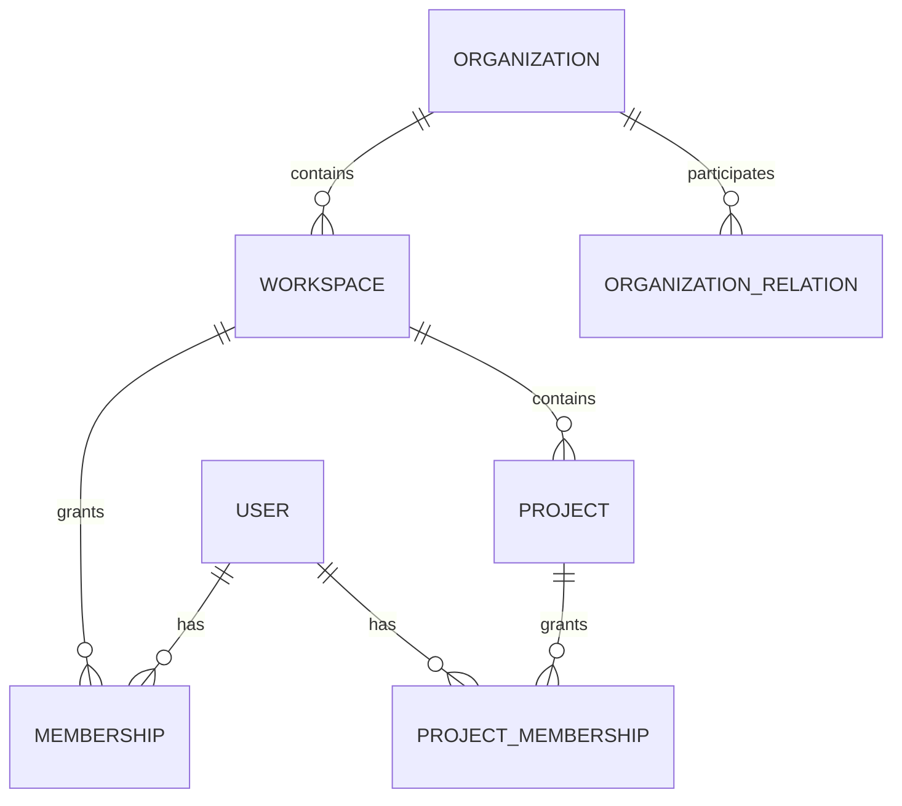
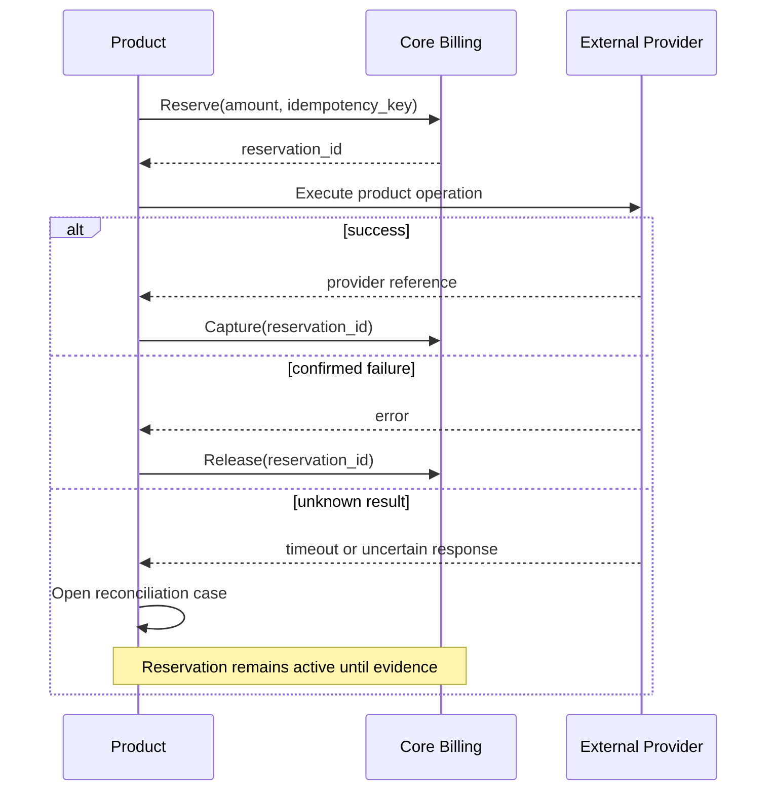

# Envidicy Core Blueprint

Статус: `Review Candidate v0.1`

Baseline: `ENVIDICY-ARCH-RC-2026-07-23-01`

## 1. Назначение Core

Envidicy Core — обязательная общая платформа для всех продуктов экосистемы. Core предоставляет идентичность, tenant-контекст, доступ, проекты, продуктовые права, денежный учёт, интеграционные подключения, файлы, уведомления и аудит.

Core не является отдельным пользовательским продуктом и не содержит бизнес-логику рекламных кампаний, креативов, CRM или ERP.

## 2. Bounded contexts Core

| Контекст | Ответственность | Основные сущности |
|---|---|---|
| Identity | Идентичность и аутентификация | User, Identity, Session, Device, LoginEvent |
| Tenancy | Организации и рабочие пространства | Organization, Workspace, Membership, OrganizationRelation |
| Projects | Общий рабочий контекст | Project, ProjectProfile, ProjectMember |
| Authorization | Роли и policy | RoleTemplate, Policy, Grant, ResourceScope |
| Module Registry | Доступные продукты и функции | ModuleDefinition, Plan, Subscription, Entitlement, FeatureFlag |
| Billing | Деньги и коммерческий учёт | BillingAccount, LedgerAccount, JournalTransaction, Reservation, Invoice, Payment |
| Integration Vault | Регистрация подключений и секретов | ConnectionProvider, IntegrationConnection, SecretRef, ConnectionBinding |
| Files | Файлы и версии | FileAsset, FileVersion, FileLink, RetentionPolicy |
| Notifications | Доставка сообщений | Notification, Delivery, Preference, Template |
| Audit | Неизменяемая история действий | AuditRecord, ChangeSet, ExportRecord |

> H0.0 note: ownership `Plan/Subscription/usage` между Module Registry и Billing уточняется в ADR-003/ADR-005 (`BF-003`). Таблица является Review Candidate, а не окончательной schema.

## 3. Tenant-модель

> H0.0 note: корневой scope Membership и точная обязательность Project принимаются ADR-001/ADR-002 (`BF-001`, `BF-002`). До этого Organization считается tenant boundary, а Project обязателен только для project-owned resources.

### 3.1. Иерархия



### 3.2. Organization

Юридическая или операционная сторона экосистемы.

Типы на первом этапе:

- `business`;
- `agency`;
- `partner`;
- `internal`.

Organization хранит стабильную идентичность, а не продуктовые настройки.

### 3.3. Workspace

Граница совместной работы, membership, подписки и настроек. У организации может быть несколько workspace, но MVP допускает один основной workspace.

Workspace не равен проекту:

- workspace объединяет людей и продукты;
- project объединяет работу вокруг бренда, клиента или направления.

### 3.4. Project

Основной контекст продуктовых данных.

Минимальные поля:

```text
id
workspace_id
name
code
status
timezone
default_currency
locale
created_by
created_at
updated_at
```

Продукты расширяют Project собственными profile-объектами. Например, Marketing OS может добавить brand profile, а Advertising OS — рекламные настройки. Core Project не должен превращаться в одну таблицу со всеми возможными полями.

### 3.5. OrganizationRelation

Типизированная деловая связь организаций:

- агентство обслуживает клиента;
- партнёр является reseller;
- компания входит в группу;
- филиал принадлежит головной организации.

Связь имеет lifecycle и роли сторон. Сама `OrganizationRelation` не выдаёт доступ. Фактические полномочия задаются отдельной ограниченной `AccessDelegation` по product/project/resource, сроку и финансовым лимитам. Это целевая замена жёстко рекламной модели `agency_clients`.

## 4. Identity

### 4.1. Разделение User и Identity

- `Principal` — общий субъект безопасности: человек, сервис, система или AI;
- `User` — человек внутри Envidicy;
- `Identity` — способ входа: email/password, Meta, Google, SSO;
- `Session` — конкретная авторизованная сессия;
- `Device` — известное устройство;
- `ServicePrincipal` — интеграция или внутренний сервис;
- `AIAgentPrincipal` — AI-агент с явно выданными capabilities.

### 4.2. Требования

- password hashes только с современным KDF;
- session token хранится на сервере в виде hash или opaque reference;
- browser session — `HttpOnly`, `Secure`, `SameSite` cookie;
- idle и absolute TTL;
- отзыв отдельных и всех сессий;
- MFA для финансовых и административных ролей;
- журнал входов, отказов и смены факторов;
- step-up authentication для критических действий;
- impersonation только отдельной ограниченной сессией.

## 5. Authorization

### 5.1. Модель

Используется комбинация RBAC и policy-based access control:

```text
Decision = Subject + Action + Resource + Scope + Context + Entitlement
```

- роли являются шаблонами удобства;
- конечное решение принимается по permissions/policies;
- действует `default deny`;
- права наследуются сверху вниз только явно разрешённым способом;
- deny для чувствительного действия имеет приоритет;
- product entitlement проверяется отдельно от permission.

### 5.2. Уровни scope

```text
organization
workspace
project
module
resource collection
resource instance
financial operation
```

### 5.3. Базовые действия

```text
view
create
update
delete
approve
publish
execute
fund
export
manage_access
impersonate
administer
```

Продукты расширяют actions, например `campaign.launch` или `creative.approve`, но не создают собственную систему auth.

## 6. Module Registry и entitlements

### 6.1. ModuleDefinition

Описывает продукт или подключаемую capability:

```text
key
name
version
owner_domain
status
standalone_mode
dependencies
required_core_capabilities
available_features
```

### 6.2. Subscription

Коммерческое подключение модуля к workspace или organization.

### 6.3. Entitlement

Фактически доступная возможность:

```text
module_key
feature_key
scope
limit
valid_from
valid_until
source_plan
override
```

Permission отвечает на вопрос «может ли пользователь выполнить действие», entitlement — «куплена ли возможность и не превышен ли лимит».

### 6.4. Feature flags

Feature flag используется для rollout, а не для долгосрочной тарификации. Тарифные ограничения моделируются entitlement.

## 7. Billing и ledger

> H0.0 note: коммерческий Subscription/usage ownership и разделение `BillingReconciliationCase`/`FundingReconciliationCase` являются предметом ADR-003/ADR-005 (`BF-003`, `BF-004`).

### 7.1. Граница ответственности

Core Billing отвечает за:

- billing account клиента;
- кошельки и валюты;
- double-entry ledger;
- резервы средств;
- платежи и возвраты;
- счета и налоги;
- подписки и usage charges;
- финансовую идемпотентность;
- reconciliation финансового учёта.

Advertising OS отвечает за:

- цель пополнения;
- рекламный кабинет;
- provider-specific операцию;
- статус доставки денег/лимита на площадку;
- рекламные правила комиссии;
- результат и reconciliation с provider.

### 7.2. Ledger-модель

Баланс не является изменяемым источником истины. Он вычисляется как проекция ledger entries.

Минимальные сущности:

- `BillingAccount`;
- `LedgerAccount`;
- `JournalTransaction`;
- `JournalEntry`;
- `FundsReservation`;
- `MoneyAmount`;
- `RateSnapshot`;
- `Invoice`;
- `Payment`;
- `Refund`;
- `ReconciliationCase`.

### 7.3. Денежные инварианты

1. Сумма проводок одной journal transaction равна нулю по каждой валюте.
2. Денежные значения хранятся как `NUMERIC/DECIMAL` либо minor units, но не floating-point.
3. Операция имеет обязательный `idempotency_key`.
4. Запрещён отрицательный available balance, если не выдан credit limit.
5. Reservation проходит только состояния:

```text
requested → active → captured
                   ↘ released
                   ↘ expired
```

6. Capture и release выполняются не более одного раза.
7. Внешняя бизнес-операция не считается завершённой только по внутреннему изменению баланса.
8. Корректировка выполняется компенсирующей проводкой, а не изменением истории.
9. FX всегда ссылается на неизменяемый `rate_snapshot_id`.
10. Каждая операция хранит actor, source, correlation и audit reference.

### 7.4. Product order pattern

Продукт создаёт order со своей семантикой. Core Billing создаёт quote/reservation и возвращает идентификаторы. После внешнего результата продукт запрашивает capture или release.



## 8. Integration Vault

> H0.0 note: Vault является authoritative store секретов и authorization metadata; протокол refresh, runtime health и credential lease окончательно принимаются ADR-004 (`BF-005`).

### 8.1. Что хранит Core

- provider/connection type metadata;
- connection owner и scope;
- OAuth metadata;
- encrypted secret reference;
- requested/granted scopes;
- token expiry metadata;
- состояние авторизации;
- connection bindings к organization/workspace/project/module;
- webhook endpoint metadata без истории delivery;
- consent и actor, создавший подключение.

### 8.2. Что не хранит Core

Core не интерпретирует Meta campaign, TikTok advertiser или Google customer. Connector code, sync jobs, cursors/checkpoints, retry, rate limiting, runtime health и webhook deliveries принадлежат Shared Integration Runtime; provider-specific mapping принадлежит продукту.

### 8.3. Инварианты

- секреты не возвращаются в UI после сохранения;
- секреты не попадают в логи, события и warehouse;
- refresh выполняется централизованно;
- доступ к secret выдаётся только конкретному connector runtime;
- ротация и отзыв аудируются;
- connection может быть `healthy`, `degraded`, `expired`, `revoked`, `error`;
- scopes сравниваются с требуемыми capability продукта.

## 9. File and Media Storage

### 9.1. FileAsset

Логическая сущность файла:

```text
id
workspace_id
project_id
kind
classification
owner_domain
storage_object_ref
mime_type
size
checksum
status
created_by
```

### 9.2. Обязательные возможности

- object storage в production;
- версии;
- malware/content validation pipeline;
- signed download/upload URLs;
- ACL через Core Authorization;
- retention и legal hold;
- soft delete и контролируемое физическое удаление;
- продукт хранит смысловую связь своей сущности с `file_asset_id`; Core хранит версии, доступ и lifecycle файла;
- отдельная политика для документов, PII и публичных media assets.

## 10. Notification Center

Notification Center хранит намерение уведомить, recipient resolution, preferences и внутренний inbox. Фактическую отправку во внешние каналы выполняет Shared Delivery Gateway, а Core хранит итоговый delivery status.

Каналы:

- in-app;
- email;
- Telegram;
- WhatsApp;
- push.

Продукт публикует notification intent или domain event. Центр применяет preference, template, locale, quiet hours, deduplication и retry.

Критические финансовые уведомления не могут быть полностью отключены пользователем, но канал определяется политикой.

## 11. Audit

### 11.1. AuditRecord

Каждая значимая операция фиксирует:

```text
who
acting_as
what action
resource type/id
organization/workspace/project
before/after or change set
reason
approval reference
correlation/causation
IP/device/service
timestamp
result
```

### 11.2. Обязательный аудит

- входы и управление сессиями;
- изменение memberships и permissions;
- impersonation;
- включение модулей и изменение тарифов;
- финансовые операции;
- изменение интеграций и secrets metadata;
- экспорт и удаление данных;
- публикация и запуск кампаний;
- подтверждения;
- действия AI и ручные исправления AI-результатов.

Audit не заменяет observability logs и не должен содержать секреты.

## 12. Core API surface v0.1

Минимальные application capabilities:

```text
Identity
  create_session
  revoke_session
  require_step_up

Tenancy
  create_organization
  create_workspace
  create_organization_relation
  invite_member
  create_project

Authorization
  check_permission
  grant_role
  revoke_grant
  create_delegation
  revoke_delegation

Modules
  enable_module
  disable_module
  check_entitlement
  record_usage

Billing
  create_invoice
  record_payment
  reserve_funds
  capture_reservation
  release_reservation
  get_balance_projection

Integrations
  create_connection
  rotate_connection
  revoke_connection
  get_connection_authorization_state

Files
  create_upload
  link_file
  create_download
  retire_file

Notifications
  notify
  mark_read

Audit
  append_record
  query_records
```

## 13. Scope Core v0.1

В первый релиз Core входят только возможности, необходимые Advertising OS и Creative Intelligence:

1. Organization, Workspace и Project.
2. Membership и базовая policy-модель.
3. Module Registry и простые entitlements.
4. Billing ledger, reservation и invoice/payment lifecycle.
5. Integration connection registry и encrypted secrets.
6. FileAsset и object storage.
7. Audit envelope.
8. Notification intent.
9. Общий request context и IDs.

Не входят в Core v0.1:

- сложный marketplace billing;
- полноценный visual policy builder;
- международная налоговая платформа;
- собственный identity provider для внешнего рынка;
- универсальный workflow designer;
- физическое выделение всех контекстов в микросервисы.
