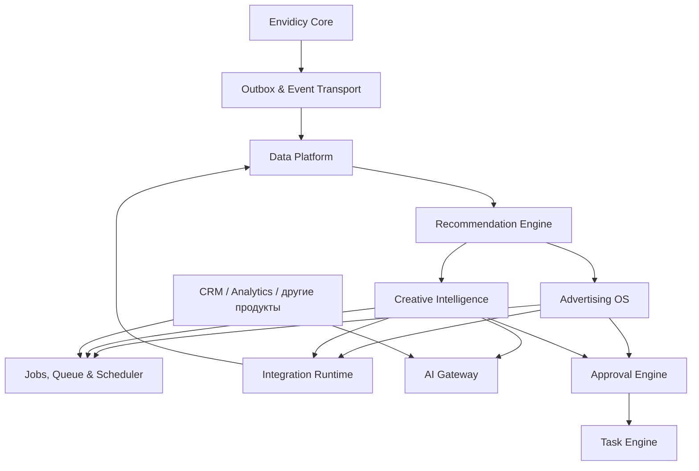
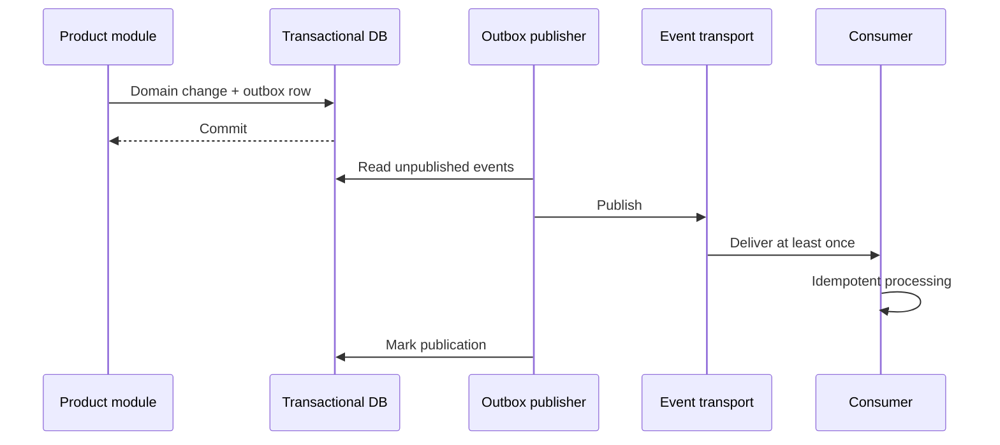

# Общие технологические сервисы Envidicy

Статус: `Review Candidate v0.1`

Baseline: `ENVIDICY-ARCH-RC-2026-07-23-01`

## 1. Назначение слоя

Shared Platform Services — переиспользуемые технические возможности между Core и продуктовыми вертикалями. Они знают **как** надёжно выполнить задачу, доставить событие, вызвать модель или синхронизировать внешний источник, но не решают, **что означает** рекламная кампания, креатив, лид или сделка.

Сервис становится общим только если выполняется одно из условий:

1. есть минимум два подтверждённых продукта-потребителя;
2. возможность критична для безопасности и надёжности всей платформы;
3. единая реализация предотвращает несовместимые контракты или дублирование чувствительной инфраструктуры.

На ближайшем этапе это **логические модули и отдельные worker-процессы**, а не обязательный набор микросервисов.

## 2. Карта сервисов



## 3. Jobs, Queue and Scheduler

### 3.1. Ответственность

- выполнение долгих и фоновых операций;
- отложенный и периодический запуск;
- retry с контролируемой политикой;
- rate limiting по провайдеру и подключению;
- дедупликация;
- отмена, timeout и heartbeat;
- dead-letter queue;
- наблюдаемость и ручной повтор.

### 3.2. Job envelope

Каждая задача содержит:

```text
job_id
job_type
job_version
tenant_context: organization_id, workspace_id, project_id
actor_context: actor_type, actor_id
correlation_id
causation_id
idempotency_key
priority
scheduled_at
attempt / max_attempts
timeout_at
payload_ref
created_at
```

Крупные файлы, медиа и секреты не помещаются в payload: передаются только ссылки с ограниченным доступом.

### 3.3. Состояния

```text
scheduled → queued → running → succeeded
                         ├── retry_wait → queued
                         ├── failed → dead_letter
                         └── cancelled
```

### 3.4. Инварианты

- доставка может быть `at least once`, поэтому обработчик обязан быть идемпотентным;
- retry не должен повторять необратимое внешнее действие без проверки статуса операции;
- у каждой задачи есть владелец продукта и runbook;
- UI никогда не ждёт завершения тяжёлой обработки в одном HTTP-запросе;
- статус задачи не является доменным статусом заказа, кампании или анализа.

## 4. Outbox и Event Transport

### 4.1. Назначение

Доменное изменение и запись события выполняются в одной транзакции. Отдельный publisher забирает запись из outbox и доставляет подписчикам. Это исключает ситуацию «данные сохранены, событие потеряно».



Event Transport отвечает за доставку, повторы и подписки. Смысл событий и их версии принадлежат доменам-производителям. Полный envelope определён в [межмодульных контрактах](./05-cross-product-contracts.md).

## 5. Integration Runtime

### 5.1. Разделение ответственности

| Компонент | Владеет |
|---|---|
| Core Integration Vault | подключением, секретом, consent, владельцем, сроком действия |
| Integration Runtime | OAuth/runtime-потоком, HTTP-клиентом, retry, rate limit, webhook ingestion, sync cursor |
| Продуктовый connector adapter | переводом внешней модели в доменную семантику продукта |

Например, общий runtime умеет обновить OAuth token и повторить запрос к Meta, но соответствие `adset → AdGroup` принадлежит Advertising OS.

### 5.2. Контракт connector adapter

Каждый адаптер описывает:

- provider и поддерживаемую версию API;
- capabilities, а не только название площадки;
- требования к credentials и scopes;
- операции read/write;
- webhook topics;
- rate-limit policy;
- схему checkpoint/cursor;
- правила нормализации ошибок;
- режим деградации;
- тестовый sandbox или fixture-набор;
- владельца и дату окончания поддержки API.

### 5.3. Модель capabilities

```text
accounts.read
accounts.provision
balance.read
funding.submit
campaigns.read
campaigns.write
creatives.read
audiences.read
audiences.write
performance.read
conversions.write
webhooks.receive
```

UI и workflows обязаны проверять capability конкретного подключения. Наличие «интеграции с площадкой» не означает поддержку всех операций.

### 5.4. Нормализованные ошибки

```text
AUTH_EXPIRED
PERMISSION_DENIED
RATE_LIMITED
INVALID_REQUEST
PROVIDER_UNAVAILABLE
RESOURCE_NOT_FOUND
CONFLICT
UNKNOWN_RESULT
COMPLIANCE_RESTRICTED
```

Исходный ответ провайдера сохраняется в защищённом диагностическом контуре, а продукт получает стабильный error code и безопасное объяснение.

## 6. Data Platform

### 6.1. Назначение

Data Platform строит аналитические копии и согласованный граф данных из доменных событий и внешних ingestion-потоков. Она не становится транзакционным владельцем пользователей, денег, кампаний, креативов или сделок.

Основные зоны:

1. **Raw** — неизменённые ответы внешних источников с lineage.
2. **Normalized** — канонические сущности и метрики.
3. **Semantic** — бизнес-показатели и согласованные определения.
4. **Serving** — витрины, отчёты, feature-наборы для AI и API чтения.

### 6.2. Обязательная метаинформация

- `source_system` и `source_ref`;
- tenant/project context;
- `observed_at`, `effective_at`, `ingested_at`;
- версия схемы и трансформации;
- полнота и quality flags;
- валюта, timezone и attribution window;
- ссылка на исходный объект или событие;
- срок хранения и data classification.

### 6.3. Правила

- raw-данные не переписываются задним числом;
- повторная загрузка идемпотентна;
- метрики хранят исходную единицу и нормализованное значение;
- изменение формулы метрики создаёт новую версию семантики;
- аналитическая витрина не используется для резервирования денег и других транзакционных решений;
- доступ к данным наследует tenant-права и purpose limitation.

## 7. AI Gateway

### 7.1. Ответственность

- единый доступ к моделям разных поставщиков;
- выбор модели по классу задачи, цене и требованиям к данным;
- шаблоны, версии prompt/config и structured output;
- лимиты бюджета и квоты;
- redaction чувствительных данных;
- audit input/output и lineage;
- кэширование безопасных детерминированных операций;
- evaluation-наборы и сравнение версий;
- fallback без сокрытия деградации качества.

AI Gateway не владеет рекомендациями, сценариями или решениями — ими владеет вызывающий продукт.

### 7.2. AI execution record

```text
execution_id
use_case
tenant_context
actor_context
model_provider / model_id
prompt_template_version
input_refs / output_ref
data_classification
token_usage / cost
started_at / completed_at
status
quality_flags
human_feedback
```

### 7.3. Уровни автономности

| Уровень | Поведение |
|---|---|
| A0 | только анализ |
| A1 | рекомендация с объяснением |
| A2 | создание черновика |
| A3 | действие после approval |
| A4 | действие в заранее заданных пределах с возможностью остановки |

Переход на следующий уровень разрешается отдельно для каждого use case, а не для «AI платформы целиком».

## 8. Approval Engine

Approval Engine обеспечивает повторяемый human-in-the-loop для финансов, публикаций, рекламных бюджетов, AI-действий и других критических операций.

> H0.0 note: capability временно классифицирована как Shared Platform. Namespace и окончательная граница принимаются ADR-005 (`BF-006`). Делегирование доступа Core и замещение согласующего — разные модели.

### 8.1. Сущности

- `ApprovalPolicy` — когда требуется согласование;
- `ApprovalRequest` — конкретный запрос с неизменяемым payload digest;
- `ApprovalStep` — последовательный или параллельный этап;
- `Decision` — approve/reject/request_changes;
- `ApproverSubstitution` — ограниченное замещение согласующего;
- `ApprovalEvidence` — объяснение, preview, risk flags и ссылки.

### 8.2. Состояния

```text
draft → pending → approved → executing → completed
                   ├── rejected
                   ├── expired
                   └── cancelled
```

Изменение критического payload после согласования аннулирует approval. Исполнение всегда повторно проверяет полномочия, entitlement, лимит и актуальность объекта.

## 9. Task Engine

Task Engine — общий механизм человеческих задач, возникающих из продуктов или workflows: проверить креатив, сверить платёж, исправить интеграцию, согласовать запуск.

Он владеет назначением, сроком, статусом, приоритетом и SLA задачи, но не копирует бизнес-сущность. Задача содержит `subject_ref` на объект владельца.

Минимальные состояния:

```text
open → assigned → in_progress → done
                    ├── blocked
                    └── cancelled
```

Approval является отдельной строгой моделью и не заменяется обычной task.

## 10. Recommendation Engine

Recommendation Engine появляется после формирования надёжного data loop. Он соединяет доказательства, паттерны и гипотезы, но не выполняет продуктовые действия напрямую.

До ADR-005 продукт владеет сохранённой `Recommendation`, а Shared Engine возвращает `RecommendationProposal` и evidence без transactional ownership (`BF-010`).

Контракт proposal:

```text
proposal_id
recommendation_type
subject_refs
evidence_refs
hypothesis
expected_effect
confidence
constraints
generated_by
valid_until
status
feedback / observed_outcome
```

Рекомендация должна быть объяснима, иметь confidence и измеримый outcome. Продукт решает, превратить ли её в draft, experiment, approval или отклонить.

## 11. Последовательность реализации

| Волна | Минимальная возможность | Подтверждённый потребитель |
|---|---|---|
| S0 | надёжные jobs, retry и scheduler | Advertising OS integrations |
| S0 | transactional outbox и базовый event envelope | Core billing, Advertising OS |
| S0 | Integration Runtime: credentials lease, rate limit, cursors | рекламные площадки |
| S1 | нормализованный рекламный ingestion | Advertising Analytics |
| S1 | AI Gateway с cost/audit/structured output | Creative Intelligence |
| S1 | Approval Engine для критических действий | funding и запуск рекламы |
| S2 | media pipeline и расширенный Data Platform | Creative Intelligence |
| S2 | Task Engine | finance reconciliation, creative review |
| S3 | Recommendation Engine | замкнутый creative-to-revenue loop |

## 12. Критерии физического выделения сервиса

Логический модуль выносится из основного backend только при измеримой причине:

- независимое масштабирование или другой профиль ресурсов;
- отдельный failure domain;
- специальные требования к безопасности или хранению;
- независимый цикл релизов с несколькими командами;
- технологическая несовместимость с основным runtime;
- доказанная эксплуатационная проблема, которую выделение решает.

До этого границы обеспечиваются собственным модулем, интерфейсом, таблицами/схемой, тестами контрактов и запретом прямых зависимостей.

## 13. Нефункциональный минимум

Для каждого общего сервиса до production обязательны:

- владелец и SLO;
- tenant isolation;
- idempotency;
- timeout, retry и circuit breaker там, где применимо;
- structured logs, metrics и trace/correlation ID;
- data retention и deletion policy;
- backpressure и лимиты стоимости;
- degraded mode;
- runbook, ручной replay и аварийная остановка;
- версионированный контракт и совместимость потребителей.
