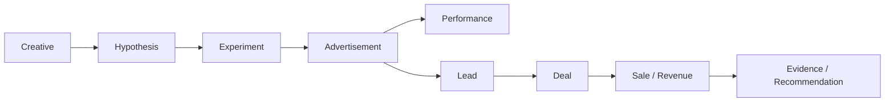

# Межмодульные контракты и события

Статус: `Review Candidate v0.1`

Baseline: `ENVIDICY-ARCH-RC-2026-07-23-01`

## 1. Цель

Документ определяет, как Core, общие сервисы и продуктовые вертикали взаимодействуют без прямого владения чужими данными. Контракт должен сохраняться независимо от того, находятся модули в одном процессе или в разных сервисах.

## 2. Базовые правила

1. У каждой сущности один transactional owner.
2. Команда просит выполнить действие; событие сообщает о факте; query возвращает представление.
3. Другой модуль не записывает в таблицы владельца.
4. Синхронный вызов используется для решения, без которого действие небезопасно.
5. Распространение фактов, аналитика, уведомления и тяжёлая обработка выполняются асинхронно.
6. Событие не является удалённым вызовом функции и не требует немедленного ответа.
7. Контракты versioned и обратно совместимы.
8. Любой consumer готов к повторной доставке.
9. Секреты, бинарные файлы и лишние персональные данные не входят в payload.

## 3. Канонические идентификаторы

### 3.1. Tenant context

```text
organization_id  — владелец данных и tenant boundary
workspace_id     — операционный контейнер внутри организации
project_id       — нейтральный cross-product correlation scope
```

Не каждая сущность имеет `project_id`: org-level connection, invoice или ledger account могут жить на уровне организации.

### 3.2. Resource reference

Универсальная ссылка используется для корреляции и аудита, но не заменяет типизированный контракт:

```json
{
  "domain": "advertising",
  "resource_type": "funding_order",
  "resource_id": "uuid",
  "version": 7
}
```

Для внешнего объекта:

```text
provider_code
connection_id
external_object_type
external_id
```

Внешний ID не используется как внутренний primary key.

### 3.3. Correlation and causation

- `correlation_id` соединяет весь бизнес-процесс;
- `causation_id` указывает непосредственно вызвавшую команду или событие;
- `request_id` относится к одному техническому запросу;
- `idempotency_key` обеспечивает безопасный повтор команды;
- `trace_id` используется observability и не заменяет бизнес-корреляцию.

## 4. Command contract

Команда адресована одному владельцу и имеет ожидаемый результат.

```json
{
  "command_id": "uuid",
  "command_type": "core.billing.reserve_funds.v1",
  "command_version": 1,
  "requested_at": "2026-07-23T10:00:00Z",
  "tenant_context": {
    "organization_id": "uuid",
    "workspace_id": "uuid",
    "project_id": "uuid"
  },
  "actor": {
    "actor_type": "user",
    "principal_id": "uuid",
    "effective_subject_id": null
  },
  "correlation_id": "uuid",
  "causation_id": "uuid",
  "idempotency_key": "client-generated-stable-key",
  "payload": {}
}
```

До выполнения command owner обязан проверить:

- authentication и tenant boundary;
- permission, delegation и entitlement;
- актуальную версию aggregate, если требуется optimistic concurrency;
- idempotency;
- policy limits и required approval;
- business invariants.

Ответ синхронной команды содержит stable result/error code и ссылку на созданный ресурс. Provider raw error не становится публичным контрактом.

## 5. Domain event envelope

```json
{
  "event_id": "uuid",
  "event_type": "advertising.funding.completed.v1",
  "schema_version": 1,
  "occurred_at": "2026-07-23T10:00:02Z",
  "producer": "advertising.funding",
  "tenant_context": {
    "organization_id": "uuid",
    "workspace_id": "uuid",
    "project_id": "uuid"
  },
  "actor": {
    "actor_type": "service",
    "principal_id": "uuid",
    "effective_subject_id": null
  },
  "aggregate": {
    "type": "funding_order",
    "id": "uuid",
    "version": 8
  },
  "correlation_id": "uuid",
  "causation_id": "uuid",
  "idempotency_key": "uuid",
  "data_classification": "internal",
  "payload": {}
}
```

### 5.1. Naming

Формат:

```text
<domain>.<aggregate-or-capability>.<past-tense-fact>.v<major>
```

Примеры:

```text
core.project.created.v1
core.billing.funds_reserved.v1
advertising.campaign.published.v1
creative.analysis.completed.v1
crm.deal.won.v1
```

Событие называет уже произошедший факт. `CreateCampaignEvent` и `ProcessPaymentEvent` — команды, ошибочно названные событиями.

### 5.2. Payload

Payload содержит минимальный стабильный snapshot, достаточный большинству consumers. Он не содержит:

- access/refresh token;
- пароль, secret и API key;
- бинарное медиа;
- полный raw provider response;
- full table dump;
- чувствительные данные «на всякий случай».

Если consumer нужны дополнительные данные, он использует разрешённый query API владельца или аналитическую projection.

## 6. Гарантии доставки

### Producer

- domain change и outbox row фиксируются в одной транзакции;
- `event_id` создаётся один раз;
- publisher безопасно повторяет отправку;
- событие публикуется только после commit;
- ordering гарантируется только внутри aggregate/partition, если он нужен.

### Consumer

- хранит processed `event_id` или inbox record;
- обрабатывает повтор идемпотентно;
- не полагается на глобальный порядок;
- выдерживает временную доставку события старой и новой версии;
- отправляет poison message в DLQ и имеет replay/runbook;
- не блокирует producer своим падением.

Гарантия всей системы — `at least once`, а не обещание невозможного exactly-once между независимыми системами.

## 7. Версионирование

Внутри major version разрешается только совместимое расширение:

- добавить optional поле;
- добавить новое enum-значение, если consumer обязан обрабатывать unknown;
- уточнить документацию без изменения смысла.

Новая major version требуется, если:

- удалено/переименовано поле;
- изменён смысл или единица измерения;
- optional стал required;
- изменены invariants;
- payload разделён или объединён.

Producer публикует старую и новую версии в transition window. Для каждой версии есть owner, schema, examples, consumers и дата deprecation.

## 8. Query и read models

### 8.1. Виды чтения

| Вид | Когда использовать |
|---|---|
| owner query API | нужны актуальные транзакционные данные или security decision |
| local projection | частое чтение небольшого набора чужих фактов, допускается eventual consistency |
| Data Platform mart | отчёты, аналитика, обучение и cross-product exploration |
| BFF aggregation | собрать UX-экран из нескольких API без создания нового source of truth |

### 8.2. Правила projection

- хранит source event/version и last applied position;
- может быть полностью перестроена;
- явно показывает freshness;
- не используется для изменения authoritative state;
- применяет tenant/data classification policy;
- изменение mapping versioned и воспроизводимо.

## 9. Каталог базовых событий

### 9.1. Core

```text
core.organization.created.v1
core.organization.relationship_activated.v1
core.workspace.created.v1
core.project.created.v1
core.membership.changed.v1
core.authorization.binding_changed.v1
core.module.activated.v1
core.entitlement.changed.v1

core.billing.quote_created.v1
core.billing.funds_reserved.v1
core.billing.reservation_captured.v1
core.billing.reservation_released.v1
core.billing.ledger_transaction_posted.v1
core.billing.payment_received.v1
core.billing.invoice_issued.v1
core.billing.reconciliation_required.v1

core.integration.connection_authorized.v1
core.integration.reauthorization_required.v1
core.integration.connection_revoked.v1
core.file.upload_committed.v1
core.file.scan_completed.v1
core.notification.delivered.v1
platform.approval.requested.v1
platform.approval.decided.v1
```

### 9.2. Advertising OS

```text
advertising.provisioning.requested.v1
advertising.ad_account.provisioned.v1
advertising.funding.requested.v1
advertising.funding.provider_confirmed.v1
advertising.funding.fulfillment_uncertain.v1
advertising.funding.completed.v1
advertising.funding.reconciliation_discrepancy_found.v1
advertising.campaign.draft_created.v1
advertising.campaign.approved.v1
advertising.campaign.published.v1
advertising.campaign.paused.v1
advertising.statistics.sync_completed.v1
advertising.anomaly.detected.v1
advertising.media_plan.version_approved.v1
```

### 9.3. Creative Intelligence

```text
creative.source.added.v1
creative.item.discovered.v1
creative.snapshot.captured.v1
creative.media.processed.v1
creative.analysis.completed.v1
creative.analysis.corrected.v1
creative.pattern.detected.v1
creative.hypothesis.created.v1
creative.experiment.started.v1
creative.experiment.completed.v1
creative.recommendation.created.v1
```

### 9.4. Будущий CRM/Sales contour

```text
crm.lead.created.v1
crm.contact.resolved.v1
crm.deal.created.v1
crm.deal.won.v1
crm.sale.recorded.v1
crm.revenue.recorded.v1
```

Названия CRM-событий являются reservation в каталоге и утверждаются вместе с PRD соответствующего модуля.

## 10. Критические workflows

### 10.1. Funding saga

```text
Advertising: FundingOrder confirmed
→ Core command: ReserveFunds
→ Core event: FundsReserved
→ Advertising: provider fulfillment
→ confirmed success: Core command CaptureReservation
→ Core event ReservationCaptured
→ Advertising event FundingCompleted

unknown result
→ Advertising event FulfillmentUncertain
→ reconciliation workflow
→ capture или release только после evidence
```

Оркестратором этой saga является Advertising Funding Operations, потому что он понимает provider fulfillment. Core независимо защищает финансовые invariants.

### 10.2. Creative-to-revenue trace



Каждая стрелка — явный binding или событие с ID обоих owners. Analytics может строить единый граф, но не становится владельцем узлов.

### 10.3. AI-assisted action

```text
facts + policy context
→ AI Gateway execution
→ product-owned Recommendation/ProposedCommand
→ authorization + entitlement + limits
→ ApprovalRequest, если требуется
→ обычная product command
→ domain event + audit
→ outcome feedback
```

AI не имеет сокращённого пути к таблице или provider token.

## 11. Consistency model

| Решение | Требуемая consistency |
|---|---|
| permission/tenant check | strong/current |
| reserve/capture/release | transactional strong consistency внутри Billing |
| provider operation | saga + idempotency + reconciliation |
| module entitlement at action time | current, cache с безопасной invalidation |
| dashboard counters | eventual consistency допустима |
| notifications | asynchronous |
| analytics/recommendations | eventual, freshness visible |
| audit critical action | атомарно или через гарантированный outbox, согласно категории |

## 12. Error contract

Стабильные категории:

```text
UNAUTHENTICATED
PERMISSION_DENIED
ENTITLEMENT_REQUIRED
VALIDATION_FAILED
CONFLICT
IDEMPOTENCY_CONFLICT
LIMIT_EXCEEDED
APPROVAL_REQUIRED
RESOURCE_NOT_FOUND
PROVIDER_AUTH_EXPIRED
PROVIDER_RATE_LIMITED
PROVIDER_UNAVAILABLE
UNKNOWN_EXTERNAL_RESULT
RECONCILIATION_REQUIRED
INTERNAL_ERROR
```

Ошибка содержит safe message, error code, correlation ID, retryability и structured details без secrets. HTTP status — transport detail, а не единственная семантика ошибки.

## 13. Contract governance

Для каждого public/internal cross-module API или event фиксируются:

- owner и reviewers;
- purpose и consumers;
- schema и примеры;
- permissions/data classification;
- idempotency/ordering guarantees;
- SLO и timeout;
- version и compatibility policy;
- rollout/deprecation plan;
- contract tests;
- link на ADR при изменении domain boundary.

Шаблон расположен в [templates/event-contract.md](./templates/event-contract.md).
