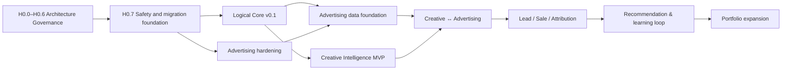

# План развития Envidicy

Статус: `Review Candidate Supporting v0.2`

Baseline: `ENVIDICY-ARCH-RC-2026-07-23-01`

## 1. Как читать roadmap

Roadmap задаёт последовательность результатов и stage gates, а не обещанные даты. Календарь и sprint plan появляются после утверждения состава команды, доступной мощности и коммерческих приоритетов.

Главная стратегия:

```text
сохранить работающий Advertising OS
→ укрепить деньги, доступ и integrations
→ выделить логический Core
→ нормализовать рекламные данные
→ проверить Creative Intelligence
→ связать creative с рекламным экспериментом
→ добавить lead/sale outcome
→ замкнуть learning loop
```

Рекомендуемый WIP limit на текущем этапе: не более двух крупных delivery-потоков и одного discovery-потока одновременно.

## 2. Критическая цепочка



Core строится по подтверждённому спросу первых продуктов. Creative Intelligence не ждёт «идеального Core», но не создаёт собственные users/projects/files/secrets.

## 3. H0 — Architecture Governance Framework

H0 проектирует не приложение, а правила безопасного изменения приложения. До завершения H0.6 production-код, schema и production-данные не изменяются.

| Этап | Результат | Exit condition |
|---|---|---|
| H0.0 Baseline Freeze | exact `Review Candidate`, manifest, hashes, owners/reviewers и acceptance pack | baseline однозначно идентифицируем, изменения контролируются |
| H0.1 Architecture Principles + ADR | принципы и семь фундаментальных решений | Principles/ADR приняты accountable reviewers |
| Blueprint Conformance Review | матрица соответствия Principles/ADR | нет нарушения без явного exception ADR; Blueprint получает `Accepted` |
| H0.2 Golden Flow Contracts | все жизненно важные процессы имеют GF ID/version и test obligations | ни один critical flow не остаётся narrative-only |
| H0.3 Legacy → Target Mapping | tables, endpoints, services, workers, cron, integrations сопоставлены target owners | нет неизвестного writer/side effect |
| H0.4 Migration Safety & Recovery | backup, restore validation, compatibility, compensation и DR | стратегия проверяема без обещания «откатим БД» |
| H0.5 Epic → Story → Task | delivery decomposition, dependencies и acceptance | каждая задача трассируется до решения/контракта/GF |
| H0.6 Final Readiness Gate | `GREEN`, обоснованный `N/A` или `STOP` по каждой проверке | любой `STOP` блокирует H0.7; статуса `YELLOW` нет |
| H0.7 Controlled Start | backup, isolated restore validation, первая migration и development | начинается только после GREEN H0.6 |

Порядок принятия Blueprint:

```text
Draft
→ Review Candidate (Baseline Freeze)
→ Architecture Principles
→ ADR
→ Blueprint Conformance Review
→ Accepted
```

Подробные правила находятся в [Architecture Governance Framework](./00-architecture-governance-framework.md).

## 4. H0.7 / Delivery Wave 1 — Safety and migration foundation

### Цель

Снизить риск работающего бизнеса до расширения платформы.

### Поток A: безопасность и эксплуатация

- закрыть незащищённые write paths;
- убрать hardcoded privileged identity;
- формализовать server-side tenant/access checks;
- secret/log redaction и rotation path;
- audit для денег, прав, impersonation и integrations;
- production database migration framework;
- CI для backend/frontend, обязательные smoke/golden tests;
- backup/restore validation;
- structured logging, error/correlation IDs и основные alerts.

### Поток B: финансовые инварианты

- выбрать `Decimal` или minor-unit representation;
- описать chart of accounts;
- запретить direct mutable balance в новых flows;
- durable idempotency records;
- append-only financial history и compensating reversals;
- reconciliation model и manual evidence;
- state machine Funding Order/provider attempts.

### Platform minimum

- durable jobs, timeout/retry/DLQ;
- transactional outbox;
- base command/event envelope;
- migration compatibility layer.

### Exit gate

- повтор, timeout и restart критического flow не создают двойных денег;
- критический endpoint имеет authz/audit test;
- schema migration воспроизводима на копии production-like данных;
- backup восстановлен в тестовой среде;
- golden flows наблюдаемы по одному correlation ID.

## 5. Волна 2 — Logical Core v0.1 + Advertising hardening

Эти потоки идут параллельно и встречаются в funding/account flows.

### Core v0.1

- Organization, default Workspace и Project;
- mapping legacy users/agencies/clients;
- Membership, scoped RoleBinding и AccessDelegation;
- Core Billing interfaces: quote/reserve/capture/release/reverse;
- ledger-backed wallet read model;
- Integration Connection + SecretReference;
- минимальные FileAsset, Notification Intent и Audit;
- ModuleDefinition и effective entitlement для Ads/CI.

### Advertising OS

- отдельные модули accounts/provisioning/funding/analytics/media planning;
- AdAccount organization/project ownership;
- provisioning attempts, SLA и evidence;
- Funding Order и provider fulfillment states;
- Meta funding через durable idempotency и reconciliation;
- ручные providers через operator task/evidence;
- MediaPlan naming/versioning;
- legacy API facade сохраняет совместимость.

### Migration pattern

```text
expand
→ backfill
→ shadow write/read
→ compare
→ feature-flagged cutover
→ observe
→ contract legacy
```

### Exit gate

- существующий клиент однозначно mapped в Organization/Workspace/Project;
- ledger projection совпадает с legacy balance в согласованном tolerance, расхождения разобраны;
- один реальный Meta funding flow проходит reserve→provider→capture→reconcile;
- uncertain outcome обрабатывается без ложного release;
- Advertising-модуль не меняет Core ledger напрямую;
- rollback и legacy fallback протестированы.

## 6. Волна 3 — Advertising Data Foundation

### Цель

Сделать рекламные данные повторяемыми и пригодными для CI, Analytics и будущей оптимизации.

### Результаты

- tenant-specific connection model;
- connector capability registry;
- общий integration runtime: cursors, retry, rate limits, connection health;
- raw/normalized layers;
- канонические AdAccount, ProviderCampaign, AdGroup, Advertisement;
- metric observations с source/timezone/currency/attribution metadata;
- freshness, completeness и quality incidents;
- Meta/Google/TikTok через единый connector contract;
- Yandex discovery/read-only — только после стабилизации первых трёх;
- read models и Integration API с version policy.

### Exit gate

- одна схема рекламных метрик работает минимум для Meta, Google и TikTok;
- ingestion replay идемпотентен;
- каждый batch имеет source, cursor, adapter version и quality status;
- dashboard показывает freshness;
- provider failure не ломает core transactional flow;
- account/campaign external refs не конфликтуют между connections.

## 7. Волна 4 — Creative Intelligence internal MVP

### Discovery до build

- выбрать один реальный Project;
- проверить legal/technical source path;
- измерить текущий research workflow и baseline времени;
- обработать один ролик end-to-end;
- определить cost/quality evaluation set;
- подтвердить, что команда использует structured result.

### MVP

- SourceAccount и Creative;
- ограниченный collection/import;
- CreativeSnapshot;
- media pipeline: transcript/OCR/scenes;
- versioned structured Analysis через AI Gateway;
- confidence и human corrections;
- search/filter;
- adapted ScenarioVersion и CreativeHypothesis;
- report;
- quotas, cost, audit и processing observability.

### Exit gate

- research time сокращён минимум вдвое на выбранном сценарии;
- команда регулярно возвращается в продукт;
- сценарии/hypotheses реально берутся в производство;
- collection method устойчив и допустим;
- processing success/cost/quality измеримы;
- продукт не дублирует Core identity/project/files/integration.

Если utility не доказана, масштабный collection и агентская версия не запускаются.

## 8. Волна 5 — Creative ↔ Advertising

### Цель

Получить первый замкнутый контур на рекламных метриках.

### Результаты

- Creative/Advertisement binding;
- fingerprint + human-confirmed matching;
- Experiment registry;
- hypothesis, variants, audience и budget constraints;
- campaign/ad performance linkage;
- experiment conclusion и evidence;
- plan/experiment/actual comparison;
- первый Campaign Builder draft/preview flow;
- Approval Engine для publish/budget change.

### Exit gate

Для одного реального проекта прослеживается:

```text
source creative
→ analysis
→ adapted hypothesis
→ produced creative
→ advertisement
→ campaign performance
→ experiment conclusion
```

Идентификаторы и результат восстанавливаются из contracts, а не ручной таблицы.

## 9. Волна 6 — Lead, Sale and Attribution

### Цель

Перейти от рекламного performance к коммерческому outcome.

### Рекомендуемый scope

- Consent & Privacy minimum;
- Lead Capture contracts;
- CRM Overlay поверх одной существующей CRM;
- Contact/Lead/Deal/Sale external refs;
- campaign/creative attribution IDs;
- revenue, margin и quality outcome;
- прозрачная первая attribution model;
- reconciliation unmatched/duplicate identities;
- executive full-loop read model.

Не следует начинать с полной собственной CRM, PBX и omnichannel suite.

### Exit gate

Для одного Project измерим контур:

```text
Creative → Ad → Lead → Deal → Sale → Revenue/Margin
```

- consent и data lineage доказуемы;
- unmatched/ambiguous cases видимы;
- attribution method/version/window показаны пользователю;
- результат не подменяется недоказанной AI-оценкой.

## 10. Волна 7 — Recommendation and Learning Loop

### Цель

Использовать накопленные эксперименты для следующей гипотезы.

### Результаты

- Pattern с evidence/sample/confidence;
- Recommendation с expected effect и validity;
- feedback/outcome linkage;
- evaluation и controlled experiments;
- AI Targetologist/Creative Strategist в A1–A2;
- policy limits и approval для A3;
- explainability, cost guardrails и kill switch;
- controlled optimizer pilot.

### Exit gate

- recommendation сравнивается с baseline/control;
- uplift статистически и бизнесово осмыслен хотя бы в узком сегменте;
- каждое действие объяснимо и аудируемо;
- rollback и budget limits работают;
- негативный outcome возвращается в evidence, а не скрывается.

## 11. Волна 8 — Portfolio expansion

Новая вертикаль допускается только если:

- есть подтверждённая проблема и target segment;
- назначены product/engineering owners;
- есть отдельная P&L или ясный вклад в основной loop;
- пройден legal/feasibility discovery;
- определён data owner и contracts;
- Core/shared enablers не строятся без реального потребителя;
- новая работа не ухудшает надёжность Advertising OS.

Предпочтительный порядок: узкий Reputation/Proof/Influencer pilot раньше marketplace; CRM Overlay раньше собственной CRM; integration/buy раньше собственного PBX, messenger, editor или ERP.

## 12. Параллельные workstreams

| Stream | PH0 | PH1 | PH2 |
|---|---|---|---|
| Product/Portfolio | blueprint, golden flows, metrics | CI discovery, Ads workflows | experiment и CRM overlay discovery |
| Core | tenancy/authz/billing contracts | Vault, Files, Entitlements | privacy/consent и developer platform |
| Advertising | funding/reconciliation | connections/data/account ownership | campaign drafts/CAPI |
| Data | outbox/raw conventions | canonical ad ingestion | creative/ad/lead graph и attribution |
| AI/Creative | feasibility prototype | internal CI MVP | experiments/recommendations foundation |
| Security/Operations | critical access, migrations, backups | tenant tests, SLO/runbooks | privacy, scale and automation controls |

Если команда одна, первая delivery-волна после H0.6 выполняется последовательно: safety → ledger/funding → tenancy compatibility → jobs/outbox → connector foundation. Нельзя параллелить всё ценой незавершённых critical flows.

## 13. Stage gates

| Gate | Переход | Доказательство |
|---|---|---|
| H0.6 Final Readiness | architecture planning → controlled implementation | все обязательные категории `GREEN` или обоснованно `N/A`; любой `STOP` блокирует старт |
| G0 Capture | idea → registry | ясна проблема и стратегическая связь |
| G1 Discover | registry → discovery | owner, segment, value hypothesis, kill criteria |
| G2 Commit | discovery → approved | спрос, feasibility, dependencies, economics, KPI |
| G3 Build | approved → building | Definition of Ready и выделенная команда |
| G4 Pilot | building → beta | E2E, observability, support, security и применимый recovery mechanism |
| G5 Production | beta → production | pilot KPI, SLO и operational readiness |
| G6 Scale/Exit | production → scale/retire | adoption, unit economics, TCO |

Решение на gate: `advance`, `revise`, `hold` или `kill`.

## 14. Приоритизация

Value score, шкала 1–5:

| Фактор | Вес |
|---|---:|
| подтверждённый спрос текущих клиентов | 20% |
| выручка, retention или margin | 20% |
| вклад в full loop | 20% |
| накопление уникальных данных | 15% |
| reuse другими модулями | 15% |
| снижение финансового/операционного риска | 10% |

Load score:

| Фактор | Вес |
|---|---:|
| delivery complexity | 50% |
| cost of operation | 20% |
| external/legal dependencies | 20% |
| uncertainty | 10% |

```text
Priority Index = Weighted Value × Confidence / Weighted Load

Confidence:
0.5 — предположение
0.8 — интервью/прототип
1.0 — фактическое использование или оплата
```

Security, finance и compliance blockers имеют обязательный приоритет поверх score.

## 15. Рекомендуемое распределение мощности

До пересмотра после Wave 2:

- 50% — Advertising OS и эксплуатационная надёжность;
- 35% — Core/Data/Creative loop enablers;
- 15% — discovery следующего продукта.

Это ориентир портфеля, а не требование к каждому sprint. Незавершённый денежный или security risk может временно занять большую долю.

## 16. Главная стратегическая вершина

Успех первой большой фазы — не количество запущенных модулей. Это доказанный и воспроизводимый контур:

```text
Creative hypothesis
→ Ad experiment
→ Lead
→ Deal
→ Sale
→ Profit
→ Evidence
→ Next hypothesis
```

Пока он не работает на одном реальном проекте, расширение десятков дальних модулей должно оставаться на уровне discovery/portfolio cards.
