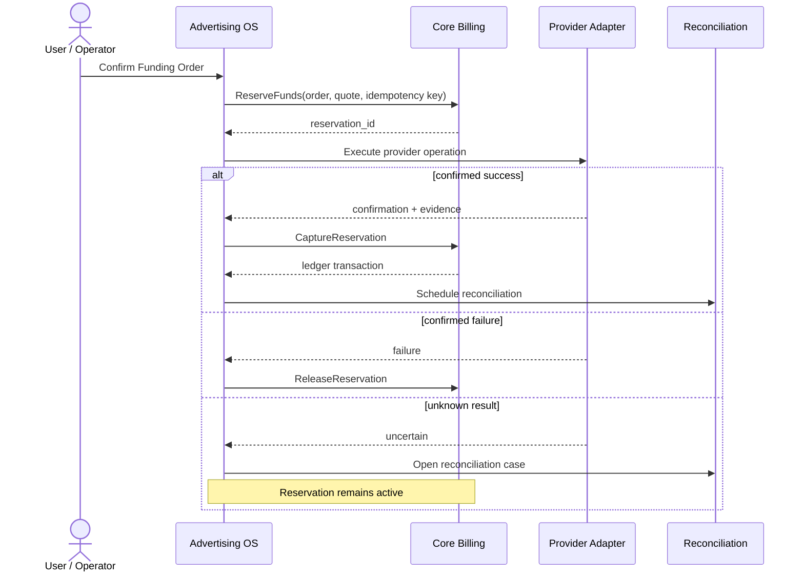

# Envidicy Advertising OS

Статус: `Draft v0.1`

## 1. Роль продукта

Advertising OS — первая коммерчески работающая продуктовая вертикаль Envidicy. Она управляет операционным циклом платной рекламы:

```text
медиаплан
→ открытие или подключение кабинета
→ пополнение
→ кампания и запуск
→ статистика
→ сверка
→ отчётность
→ оптимизация
```

Продукт владеет рекламным намерением, рекламными объектами и исполнением операций у провайдеров. Core владеет субъектами, доступом, деньгами и универсальной инфраструктурой доверия.

## 2. Фактическая зрелость

| Контур | Состояние | Комментарий |
|---|---|---|
| кабинеты | `PRODUCTION` | единый внутренний реестр площадок |
| заявки на открытие | `PRODUCTION / MANUAL` | локальное одобрение не равно фактическому provisioning у провайдера |
| пополнения и комиссии | `PRODUCTION` | финансовая и рекламная логика пока связаны |
| Meta | `L1 + PARTIAL L2` | read analytics, аудитории, billing и автоматический `spend_cap`; durable idempotency/reconciliation не завершены |
| Google Ads | `PARTIAL L1` | read analytics/audiences, billing best effort |
| TikTok Ads | `PARTIAL L1` | campaigns/ad groups/ads, daily metrics, balance best effort |
| Yandex, Telegram, Monochrome | `L0` | внутренний реестр и ручные операции |
| агентский контур | `PRODUCTION` | специальные agency-сущности вместо универсальной tenancy-модели |
| аналитика и отчётность | `PRODUCTION / PARTIAL` | нет общего ingestion runtime и формальной свежести |
| медиапланирование | `PRODUCTION / PARTIAL` | forecast, plan/fact, AI assistant, импорт/экспорт |
| campaign write | `DESIGN` | сейчас есть чтение, но нет унифицированного создания/редактирования |
| CAPI / Optimizer / Autopilot | `CONCEPT` | требуют надёжного data loop и approval |

### Терминологический долг

Текущая сущность `campaigns` является контейнером медиаплана, а не кампанией рекламного провайдера. В целевой модели это разные контексты:

- `MediaPlan` и `MediaPlanVersion`;
- `ProviderCampaign`, `AdGroup` и `Advertisement`;
- явная связь строк плана с фактическими рекламными объектами.

## 3. Граница владения

| Core | Advertising OS | Shared services |
|---|---|---|
| Identity, sessions, MFA | AdAccount | Jobs, queue, scheduler |
| Organizations, Workspaces, Projects | Account Provisioning | Outbox и event transport |
| Membership, RBAC, delegation | Funding Order | Integration Runtime |
| Entitlements | Provider fulfillment | rate limiting и retry |
| BillingAccount и immutable ledger | Provider reconciliation | Data pipeline и raw storage |
| Reservation/capture/release | Provider campaigns и ads | AI Gateway |
| Payments, invoices, legal profiles | рекламные ставки и rebates rules | Approval Engine |
| Integration Vault | рекламная нормализация данных | Recommendation Engine |
| Files, Notifications, Audit | Media Planning, plan/fact | observability |

Core не знает про `Meta spend_cap`, customer/advertiser ID, объявления, модерацию, CPL, CPM и ROAS. Advertising OS не меняет баланс, не пишет проводки и не хранит refresh token в доменной таблице.

## 4. Модули Advertising OS

### 4.1. Advertising Account Management

Ответственность:

- канонический реестр кабинетов;
- provider и внешний ID;
- организация-владелец и управляющая организация;
- привязки к Project;
- доступ к отдельным кабинетам;
- состояние подключения и кабинета у провайдера;
- группы, представления и история изменений.

```text
AdAccount
├── owner_organization_id
├── managed_by_organization_id?
├── provider
├── external_account_id
├── connection_id?
├── status
└── project_bindings[]
```

Кабинет принадлежит организации, а не пользователю. Один пользователь получает доступ через membership, delegation и resource grant.

### 4.2. Account Provisioning

Модуль ведёт заявку на открытие/подключение, проверки, provider-specific данные, ручные и автоматические шаги, SLA, ответственного, evidence и внешний ID.

```text
draft → submitted → in_review → provider_processing → provisioned
                          ├── rejected
                          ├── failed
                          └── cancelled
```

`approved` — внутреннее решение. `provisioned` — подтверждённый результат у провайдера. Эти состояния не являются синонимами.

### 4.3. Funding Operations

Advertising OS владеет:

- `FundingQuoteRef` и `FundingOrder`;
- snapshot рекламных условий;
- видом provider-операции;
- попытками исполнения;
- provider confirmation/evidence;
- ручной задачей;
- reconciliation case;
- ссылками на Core reservation и ledger transaction.

Виды исполнения различаются явно:

```text
spend_cap_increment
balance_transfer
invoice_allocation
credit_line_allocation
manual_confirmation
```

Meta `spend_cap` — один вид provider fulfillment, а не универсальная модель перемещения денег.

Три независимых состояния предотвращают смешение бизнес-заказа, внешней операции и сверки:

```text
order_status:
created | reserved | processing | completed | failed | cancelled | reversed

fulfillment_status:
not_started | awaiting_operator | submitted | confirmed | uncertain

reconciliation_status:
not_due | pending | matched | discrepancy | resolved
```

### 4.4. Provider Integration Layer

Каждый адаптер объявляет capabilities:

```text
accounts.discover       accounts.provision
billing.read            funding.submit
campaigns.read          campaigns.write
campaigns.publish       budgets.write
audiences.read          audiences.write
performance.read        conversions.write
moderation.read         webhooks.receive
```

Наличие provider в справочнике не означает поддержку операции. UI и workflows проверяют capability конкретного connection.

### 4.5. Unified Ads Manager

Модуль владеет:

- нормализованной иерархией campaign/ad group/ad;
- бюджетом, расписанием и статусами;
- аудиториями, creative bindings, landing pages и UTM;
- moderation state;
- массовыми actions;
- draft/preview/diff;
- синхронизацией local state с provider state.

Каноническая модель сочетает общие поля, provider extension и ссылку на raw payload. Различия платформ не скрываются искусственно.

### 4.6. Advertising Analytics

Advertising OS определяет рекламную семантику:

- spend, impressions, reach, clicks, conversions;
- CPM, CPC, CTR, CPL, CPA, ROAS;
- account/campaign/ad group/ad dimensions;
- breakdowns и balance snapshots;
- freshness, completeness и quality flags;
- plan/fact и рекламные marts.

Shared Data Platform выполняет ingestion и хранение, но определения метрик и provider normalization принадлежат продукту. Performance API не является источником истины для Core ledger.

### 4.7. Agency Advertising Operations

Core хранит две организации, memberships и relationship «агентство обслуживает клиента». Advertising OS хранит предметные условия:

- обслуживаемые кабинеты;
- client/platform fee schedule;
- rebate rules;
- advertising service agreement;
- назначение менеджера;
- операционные и бюджетные ограничения.

Фактические деньги и выплата rebate принадлежат Core Billing; рекламная причина начисления — Advertising OS.

### 4.8. Media Planning

Отдельный bounded context:

- `MediaPlan`, версии и строки;
- assumptions и версия rate card;
- channel mix, forecast и сценарии бюджета;
- approval и экспорт;
- imported fact;
- явные bindings к provider campaigns;
- plan/fact.

Утверждённая версия плана неизменяема; любое изменение создаёт новую версию.

### 4.9. Reporting and Integration API

Advertising OS формирует рекламные read models, отчёты и API-представления. Core Developer Platform выдаёт API identity, scopes, rate limits и аудитирует вызовы. Существующий read-only API v1 остаётся совместимым на переходном этапе.

### 4.10. Будущие модули

После укрепления data foundation и provider operations:

1. Campaign Builder;
2. CAPI Hub;
3. AI Targetologist;
4. AI Contextologist;
5. Advertising Optimizer;
6. Advertising Autopilot.

Автономное изменение бюджетов запрещено до появления атрибуции, policy limits, Approval Engine, полного audit и безопасного rollback.

## 5. Доменные агрегаты

| Агрегат | Сущности |
|---|---|
| Account | AdPlatform, AdAccount, ExternalResourceReference, ProjectBinding, AccessGrant, StatusHistory |
| Provisioning | ProvisioningRequest, Step, Attempt, Evidence, Assignment, Comment |
| Funding | FundingOrder, FeeSnapshot, CoreReservationReference, ProviderAttempt, Confirmation, ReconciliationCase, Reversal |
| Campaign | ProviderCampaign, AdGroup, Advertisement, Budget, Schedule, AudienceBinding, CreativeBinding, ModerationStatus, ChangeSet |
| Performance | IngestionBatch, SyncCursor, RawProviderRecord, MetricObservation, DailyAdMetric, BalanceSnapshot, DataQualityIncident |
| Media Planning | MediaPlan, Version, Line, RateCardVersion, ForecastAssumption, Approval, PlanFactBinding, ImportedFactBatch |
| Agency Commercial | AdvertisingServiceAgreement, ClientPlatformRate, RebateRule, RebateAccrual, ManagedAccountAssignment |

Каждая предметная сущность имеет внутренний неизменяемый ID, organization/project context, provider/source ref, status history, optimistic version, created/updated timestamps и audit correlation ID. Деньги — `Decimal + ISO currency` или minor units, но не float.

## 6. Целевой процесс пополнения



Инварианты:

- Funding Order не списывает средства дважды;
- provider request не исполняется дважды с одним idempotency key;
- неизвестный результат не превращается автоматически в `failed`;
- завершённые проводки не редактируются;
- manual confirmation содержит actor, time и evidence;
- исторические FX, fee и VAT не пересчитываются;
- reversal выполняется компенсирующими операциями;
- расхождение всегда создаёт reconciliation case.

## 7. Зрелость provider-адаптеров

```text
L0 — internal registry / manual operations
L1 — reliable read-only accounts, performance and billing
L2 — reliable funding with idempotency and reconciliation
L3 — campaign drafts and confirmed writes
L4 — controlled optimization and automation
```

| Provider | Сейчас | Следующая ступень |
|---|---|---|
| Meta | L1 analytics + partial L2 funding | завершить durable idempotency/reconciliation, затем campaign drafts |
| Google Ads | L1 с системными credentials | tenant OAuth, stable ingestion, затем drafts |
| TikTok Ads | L1 с ограниченным billing | connection health, stable ingestion, затем drafts |
| Yandex Direct | L0 | discovery/read accounts и statistics |
| Telegram Ads | L0 | capability discovery и формализация manual fulfillment |
| Monochrome | L0 | capability discovery и контракт интеграции |

## 8. Основные события

```text
advertising.provisioning.requested.v1
advertising.provisioning.provider_submitted.v1
advertising.ad_account.provisioned.v1
advertising.provisioning.failed.v1

advertising.funding.requested.v1
advertising.funding.fulfillment_started.v1
advertising.funding.provider_confirmed.v1
advertising.funding.fulfillment_uncertain.v1
advertising.funding.completed.v1
advertising.funding.failed.v1
advertising.funding.reversed.v1
advertising.funding.reconciliation_discrepancy_found.v1

advertising.statistics.sync_completed.v1
advertising.statistics.sync_failed.v1
advertising.balance.snapshot_updated.v1

advertising.campaign.draft_created.v1
advertising.campaign.approved.v1
advertising.campaign.published.v1
advertising.campaign.paused.v1
advertising.campaign.budget_changed.v1
advertising.campaign.provider_rejected.v1

advertising.media_plan.created.v1
advertising.media_plan.version_approved.v1
advertising.media_plan.linked_to_campaign.v1
```

Команды в Core Billing: `ReserveFunds`, `CaptureReservation`, `ReleaseReservation`, `ReverseCapturedFunds`, `PostRebateAccrual`.

## 9. Перенос текущих компонентов

| Сейчас | Целевой владелец | Стратегия |
|---|---|---|
| users, sessions, user_accesses | Core Identity/Authorization | compatibility mapping |
| agencies, members, clients | Core Organizations | две организации + relationship/delegation |
| agency client rates | Advertising OS | сохранить как рекламные условия |
| wallets и wallet transactions | Core Billing | ledger-backed projection и parallel reconciliation |
| invoices/legal entities/issuers | Core Billing | общий финансовый контур |
| meta connections | Core Vault + Advertising binding | секрет отделить от продуктовой связи |
| ad accounts | Advertising Account Management | добавить organization/project ownership |
| account requests/events | Provisioning | расширить state machine, attempts и evidence |
| topups | Funding Operations | разделить order, reservation и provider attempts |
| account funding events | Funding Operations | append-only operational history |
| ad account stats | Advertising Analytics | временная read model, затем canonical ingestion |
| finance snapshots | Advertising Analytics | пересчитываемая projection |
| campaigns/plans/fact rows | Media Planning | отделить от provider campaigns |
| API keys/audit | Core Developer Platform/Audit | сохранить advertising scopes |
| uploads/documents | Core Files | product metadata остаётся у владельца |
| background job leases | Shared Jobs | заменить после появления worker runtime |

## 10. Миграция без big-bang rewrite

Для каждой миграции:

```text
expand → backfill → shadow write/read → compare
→ feature-flagged cutover → observe → contract
```

| Волна | Результат | Exit criterion |
|---|---|---|
| A0. Fix vocabulary | glossary, ownership, capability matrix, golden flows, ADR | каждый endpoint/table имеет целевого владельца |
| A1. Core compatibility | default organization/workspace/project, mappings, outbox, internal Core interfaces | legacy API работает, данные однозначно сопоставимы |
| A2. Module boundaries | accounts, provisioning, funding, analytics, agency, media planning | новые функции не записывают в чужие таблицы |
| A3. Financial hardening | Decimal/minor units, immutable ledger, reservations, idempotency, reconciliation | retry/timeout/restart не создаёт двойных денег |
| A4. Connections and ingestion | tenant connections, Vault, health, cursors, raw/normalized layers | измеримы source, freshness, completeness и error |
| A5. Projects and agency | org-owned accounts, project bindings, delegation, versioned rates | нет cross-tenant доступа, каждый доступ объясним |
| A6. Unified Ads Manager | canonical hierarchy, read sync, drafts, validation, preview diff | безопасный повторяемый draft до provider write |
| A7. CAPI and optimizer | conversion delivery, attribution, policy limits, approval, rollback | каждое auto-action ограничено и объяснимо |

## 11. Production gates

### Funding

- атомарность и conservation доказаны;
- replay не создаёт двойное списание/зачисление;
- uncertain сохраняет резерв до сверки;
- provider attempts и manual evidence доступны;
- reversal компенсирующий;
- historical quote неизменяем;
- расхождение наблюдаемо и имеет owner/SLA.

### Integrations

- credentials отсутствуют в логах и продуктовых таблицах;
- capability объявлена явно;
- retry учитывает idempotency;
- rate limits централизованы;
- health видим пользователю и оператору;
- адаптер имеет fixtures/contract tests и owner.

### Analytics

- raw отделён от normalized;
- ingestion идемпотентен;
- timezone/currency обязательны;
- freshness и completeness измеряются;
- дубли и пропуски диагностируются;
- performance data не подменяет ledger.

### Agency

- active relationship требуется для доступа;
- account, finance и impersonation permissions разделены;
- impersonation полностью аудируется;
- rate/rebate versioned;
- accrual и payment разделены.

### Campaigns

- первая write-версия работает через draft и approval;
- budget change имеет preview diff и audit;
- provider error нормализован, raw response сохранён;
- повтор команды безопасен;
- bulk action возвращает partial-failure report.

## 12. Архитектурное решение

Advertising OS остаётся работающим коммерческим продуктом и эволюционирует внутри модульного монолита. Сначала вводятся логические границы и контракты, затем перенос данных и поведения, и только после доказанной необходимости — физическое выделение сервисов.
